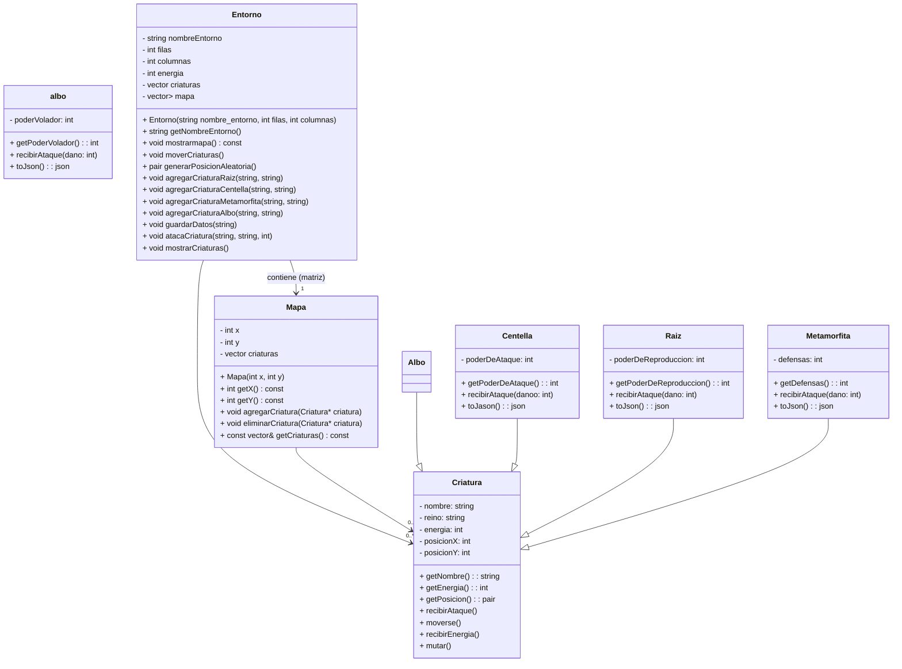

# Proyecto El Valle Iridiano
## 📘 Descripción del proyecto:
**Simulador de Entorno con Criaturas Inteligentes** es una aplicación en C++ que modela un entorno dinámico poblado por diversas criaturas con comportamientos definidos. El entorno se representa como una matriz de celdas (mapa), donde las criaturas pueden moverse, interactuar entre sí y realizar acciones específicas según su tipo.

Cada criatura pertenece a una subclase que define su comportamiento: algunas son agresivas, otras defensivas, y otras tienen habilidades especiales como volar o regenerarse. El sistema permite agregar criaturas al entorno, simular su movimiento aleatorio, realizar ataques, y almacenar información en formato JSON.

El objetivo principal es ofrecer una base modular y extensible para simular inteligencia simple en entornos gráficos o lógicos, sirviendo como herramienta educativa o base para futuros desarrollos en simulación o videojuegos.
## 🧑‍💻 Manual del usuario:
### Interfaz del juego
- **El juego se desarrolla en una cuadrícula de 10x10 donde las criaturas se mueven y interactúan, el mapa incluye:**
    - Zona de pasto: Representada por (.)
    - Zona de desierto: Representada por (_)
    - Zona de agua: Representada por (~)
- Las criaturas se representan mediante los caracteres A, B y C.

## Clases Principales
- Criatura: Clase base que define los atributos comunes a todas las criaturas (nombre, reino, energía, posición)
- Centella: Criatura con habilidades ofensivas
- Metamorfita: Criatura con capacidades defensivas
- Albo: Híbrido entre Centella y Metamorfita con capacidad de vuelo
- Raiz: Criatura que puede reproducirse.
- Mapa: El mapa se presenta en la consola, indicando los diferentes terrenos y las criaturas presentes.

## Diagramas UML

    
## 🗂️ Estructura del código fuente:
### 🔑 Módulos y Clases Clave
- Entorno: Clase principal que maneja el mapa, las criaturas y su interacción. Controla el ciclo de vida de cada     criatura     y los eventos del sistema.
- Mapa: Representa una celda individual del entorno. Contiene una lista de criaturas presentes en esa ubicación.
- Criatura (clase abstracta): Define una interfaz común para todas las criaturas. Contiene atributos como nombre, reino,     energía, y posición.
- Subclases de Criatura:
    - Albo: Criatura con atributos de ataque, defensa y vuelo.
    - Centella: Criatura enfocada en ataques.
    - Raiz: Criatura especializada en regeneración o crecimiento (por ejemplo, con tasa de interés).
    - Metamorfita: Criatura con énfasis en defensa.
### ✅ Dependencias
- nlohmann/json (presumido): Para la serialización de datos en formato JSON (guardar y cargar datos del entorno).
- Standard Template Library (STL): Uso extensivo de vector, string, pair, entre otros.
## 👥 Créditos y roles del equipo:
### - Intgrantes:
- Isabella Ramirez Echeverry
- Juan Manuel Ramirez Gonzales
### - Tareas:
- División de trabajo en el codigo:
    - Mapa: Juan Manuel Ramirez
    - Criaturas: Isabella Ramirez
- Division del README:
    - Descripcion del Proyecto: Isabella Ramirez
    - Manual del usuario: Juan Manuel Ramirez
    - Estructura del codigo fuente: Isabella Ramirez
    - Creditos y roles del equipo: Juan Manuel Ramirez
