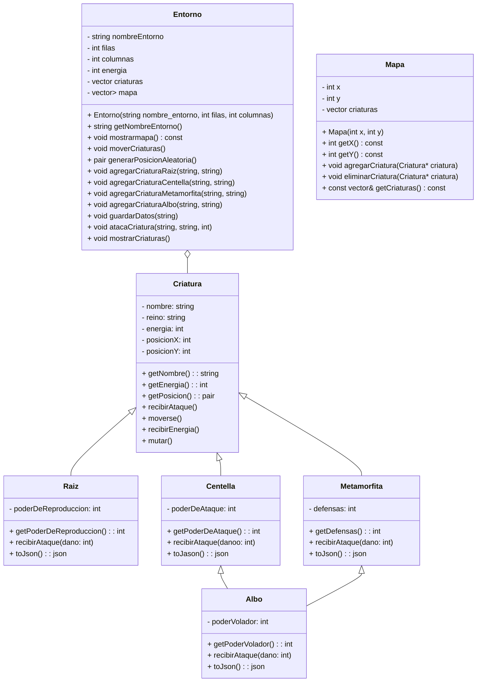

```mermaid
classDiagram
    class Entorno{
        - string nombreEntorno
    - int filas
    - int columnas
    - int energia
    - vector<Criatura*> criaturas
    - vector<vector<Mapa>> mapa
    + Entorno(string nombre_entorno, int filas, int columnas)
    + string getNombreEntorno()
    + void mostrarmapa() const
    + void moverCriaturas()
    + pair<int, int> generarPosicionAleatoria()
    + void agregarCriaturaRaiz(string, string)
    + void agregarCriaturaCentella(string, string)
    + void agregarCriaturaMetamorfita(string, string)
    + void agregarCriaturaAlbo(string, string)
    + void guardarDatos(string)
    + void atacaCriatura(string, string, int)
    + void mostrarCriaturas()
}
    class Mapa {
        - int x
        - int y
        - vector<Criatura*> criaturas
        + Mapa(int x, int y)
        + int getX() const
        + int getY() const
        + void agregarCriatura(Criatura* criatura)
        + void eliminarCriatura(Criatura* criatura)
        + const vector<Criatura*>& getCriaturas() const
    }
    class Criatura {
        - nombre: string
        - reino: string
        - energia: int
        - posicionX: int
        - posicionY: int
        + getNombre(): string
        + getEnergia(): int
        + getPosicion(): pair<int, int>
        + recibirAtaque()
        + moverse()
        + recibirEnergia()
        + mutar()
    }
    class Raiz {
         - poderDeReproduccion: int
        + getPoderDeReproduccion(): int
        + recibirAtaque(dano: int)
        + toJson(): json
    }
    class Centella {
        - poderDeAtaque: int
        + getPoderDeAtaque(): int
        + recibirAtaque(danoo: int)
        + toJason(): json
    }
    class Metamorfita {
       - defensas: int
        + getDefensas(): int
        + recibirAtaque(dano: int)
        + toJson(): json
    }
    class Albo {
       - poderVolador: int
        + getPoderVolador(): int
        + recibirAtaque(dano: int)
        + toJson(): json
    }
Entorno o-- Criatura
Criatura <|-- Raiz
Criatura <|-- Centella
Criatura <|-- Metamorfita
Centella <|-- Albo
Metamorfita <|-- Albo

```
